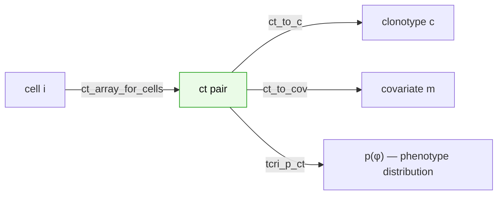
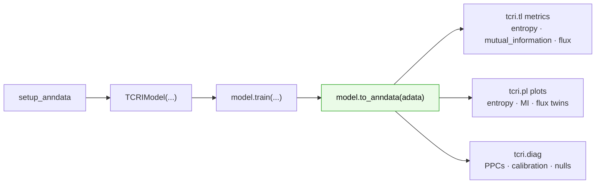

# Data model & concepts

This page is the end-to-end mental model for TCRi: the objects it learns, where
they live on your `AnnData`, and how the hierarchical model connects gene
expression, clonotypes, and phenotypes. Read it once before the API reference and
the rest will make sense.

## The problem

TCRi works on **paired single-cell data**: every cell has both a gene-expression
profile and a TCR **clonotype** label, and belongs to a **covariate** group
(e.g. timepoint, response status). The questions it answers are *distributional*:
for a given clonotype, what is its distribution over **phenotypes**, and how does
that distribution shift across covariates? From those distributions TCRi computes
information-theoretic summaries (entropies, mutual information, flux).

Three index sets recur throughout:

| Symbol | Meaning | Example |
|--------|---------|---------|
| $c$ | clonotype | a TCR clone |
| $m$ | covariate value | `T1`, `T2` |
| $\phi$ | phenotype | `A`, `B`, `C` |

A **`ct` pair** is a specific $(c, m)$ combination — clonotype $c$ observed at
covariate $m$. Every cell maps to exactly one `ct` pair.

## The hierarchical model

`TCRIModel` is a two-level Bayesian model fit with Pyro on top of an scVI-style
variational autoencoder. The generative story:

1. **Clonotype prior $p_c$.** Each clonotype draws a distribution over phenotypes
   from a mixture-Dirichlet prior: $p_c \sim \text{MixtureDirichlet}(\cdot)$,
   shape `(n_clonotypes, P)`. This is the *top* of the hierarchy — what a clone
   looks like overall.
2. **Local distribution $p_{ct}$.** For each `ct` pair, a covariate-specific
   distribution is drawn, anchored to its clone's prior:
   $p_{ct} \sim \text{Dirichlet}(\texttt{local\_scale}\cdot p_{c[ct]})$. This lets
   a clone's phenotype mix *shift per covariate* while staying tied to the clone
   prior. `local_scale` controls how tightly: large → stay near the prior.
3. **Latent $z$.** Each cell's expression $x$ is encoded to a latent $z$ under a
   [VampPrior](https://arxiv.org/abs/1705.07120) mixture, and a ZINB decoder
   reconstructs counts (the scVI-style expression model).
4. **Per-cell phenotype.** A classifier maps $z$ to phenotype **logits**
   (expression-based evidence), which are fused with the log of the cell's local
   prior $\log p_{ct}$ through a **gate** $\pi$ (`gate_prob`, default `0.5`):
   $\operatorname{softmax}\!\big(\pi\,\text{logits} + (1-\pi)\log p_{ct}\big)$.
   Setting `gate_prob=None` recovers the purely additive rule
   $\operatorname{softmax}(\text{logits} + \log p_{ct})$.

So a cell's phenotype call fuses two sources: *what its expression looks like*
(classifier logits) and *what its clone tends to be at this covariate*
($p_{ct}$). The variational **guide** learns approximate posteriors
$q(p_c)$ and $q(p_{ct})$; `TCRIModel`'s `get_p_ct()` returns the posterior-mean
$p_{ct}$.

## What `to_anndata` writes

After training, {meth}`model.to_anndata <tcri.model._model.TCRIModel.to_anndata>`
materializes the learned quantities onto your `AnnData` under the canonical
`tcri_*` keys (defined once in `tcri._keys`) so every downstream function can read
them. This is the **data model** the rest of the library assumes:

| Location | Key | Meaning | Shape |
|----------|-----|---------|-------|
| `.uns` | `tcri_p_ct` | posterior-mean local phenotype distribution per `ct` pair | `(n_ct, P)` |
| `.uns` | `tcri_ct_to_c` | clonotype index for each `ct` pair | `(n_ct,)` |
| `.uns` | `tcri_ct_to_cov` | covariate index for each `ct` pair | `(n_ct,)` |
| `.uns` | `tcri_ct_array_for_cells` | `ct`-pair index for each **cell** | `(n_cells,)` |
| `.uns` | `tcri_cov_array_for_cells` | covariate index for each **cell** | `(n_cells,)` |
| `.uns` | `tcri_local_scale` | Dirichlet concentration scale for posterior sampling | scalar |
| `.uns` | `tcri_gate_prob` | classifier/prior gate weight (`NaN` if gating is off) | scalar |
| `.uns` | `tcri_classifier_temperature` | temperature applied to classifier logits | scalar |
| `.uns` | `tcri_{phenotype,clonotype,covariate}_categories` | category label lists (index ↔ name) | — |
| `.uns` | `tcri_metadata` | column-name mapping (`phenotype_col`, `clone_col`, `covariate_col`, `batch_col`) | dict |
| `.obsm` | `X_tcri` | latent means $z$ | `(n_cells, n_latent)` |
| `.obsm` | `X_tcri_logits` | classifier phenotype logits (expression evidence) | `(n_cells, P)` |
| `.obsm` | `X_tcri_logposterior` | `logits + log p_ct` (additive, ungated) | `(n_cells, P)` |
| `.obsm` | `X_tcri_probabilities` | per-cell phenotype posterior (**gate-aware**, from `predict`) | `(n_cells, P)` |
| `.obs` | `tcri_phenotype` | hard phenotype label (argmax of the posterior) | `(n_cells,)` |

```{important}
These per-cell `.uns` arrays (`tcri_ct_array_for_cells`, `tcri_cov_array_for_cells`)
are stored in the **original full-cell space**. Slicing the `AnnData` to a view or
subset shifts `.obs`/`.obsm` but **not** `.uns`, so the indices misalign. Re-run
`model.to_anndata` on a subset, or pass the full object and filter with the
`clones=` argument. The metric functions guard against this and raise rather than
return silently-wrong numbers.
```

### Indexing, concretely

The `ct_to_c` / `ct_to_cov` arrays are the join keys that connect a cell to its
clone, its covariate, and its phenotype distribution:



A cell's local prior is therefore `tcri_p_ct[ct_array[cell]]`, and all cells of a
given covariate are `cov_array_for_cells == m`.

## Point estimate vs. posterior samples

Two ways to read the clone→phenotype distributions:

- **Point estimate** — use the posterior mean `tcri_p_ct` directly (`n_samples=0`,
  the default).
- **Posterior samples** — draw
  $p_{ct} \sim \text{Dirichlet}(\texttt{local\_scale}\cdot \bar p_{ct})$ to
  propagate uncertainty into the metrics.

{func}`joint_distribution <tcri.tools._joint.joint_distribution>` exposes both:
passing `n_samples > 0` returns a stack of posterior draws instead of a single
point estimate, and the entropy / mutual-information / flux functions accept the
same `n_samples` argument to report a posterior mean ± HDI.

## From distributions to metrics

The **joint distribution** $p(c, \phi)$ for a covariate — clonotypes × phenotypes,
optionally weighted by clone size — is the input to every information-theoretic
metric in `tcri.tl`:

- **Phenotypic entropy** $H(\phi \mid c)$ — how phenotypically mixed a clone is.
- **Clonotypic entropy** $H(c \mid \phi)$ — how clonally diverse a phenotype is.
- **Mutual information** $I(c; \phi)$ — how much knowing the clonotype tells you
  about phenotype (clone–phenotype coupling).
- **Flux** — change in a clone's phenotype distribution between two covariates.

## Temperatures

Three distinct "temperatures" sharpen ($T<1$) or flatten ($T>1$) distributions at
different stages — don't conflate them:

| Parameter | Acts on |
|-----------|---------|
| `prior_temperature` | the fixed clone→phenotype prior, at model setup |
| `guide_temperature` | the learned variational posteriors $q(p_c)$, $q(p_{ct})$ |
| `temperature` (in `joint_distribution*`) | the combined per-cell distribution at query time |

## Typical flow



With the objects above on your `AnnData`, the API reference for
[metrics](../api/metrics.md), [plotting](../api/plotting.md), and
[diagnostics](../api/diagnostics.md) tells you the exact call signatures.
