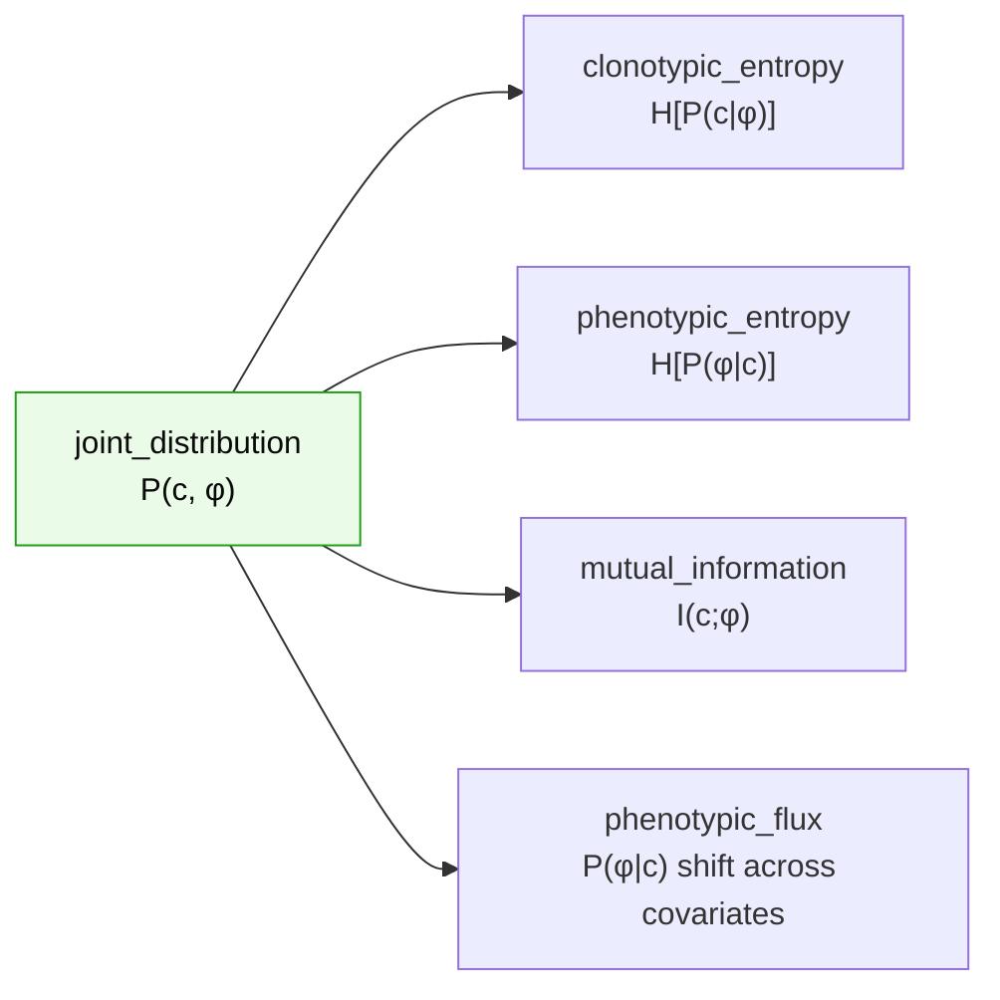

# Information-theoretic metrics

TCRi summarizes the learned **clone × phenotype joint distribution** with a small family
of information-theoretic quantities. All are computed in **bits** (log base 2). Their
definitions are frozen by the [metrics contract](../contracts/index.md); this page is the
conceptual reference.

```{note}
Equation numbers here refer to the **metrics document** (eqs 2–7: joint entropy, the two
conditional entropies, MI, NMI, and the KL used by flux), which numbers independently from
Supplementary Note 1.
```

## From the joint to the metrics



Every metric is a **pure function of the joint** produced by
{func}`tcri.tl.joint_distribution`, so they can be computed from a point estimate
(`n_samples=0`) or over posterior draws (`n_samples>0`, returning a mean ± HDI).

## Clonotypic entropy — one value per phenotype

$$H[P(c\mid\phi)] = -\sum_c P(c\mid\phi)\,\log_2 P(c\mid\phi)$$

How spread a phenotype is across clones. It is **support-only**: clones with zero mass in
that column are dropped *before* renormalizing (no epsilon clip, which would fabricate
uniform mass on absent clones and inflate the entropy). The normalizer is
$\log_2(\#\text{supported clones})$, or $\log_2(\texttt{n\_clones\_ref})$ when supplied so
values are comparable across groups. An empty column returns **NaN**.

## Phenotypic entropy — one value per clone

$$H[P(\phi\mid c)] = -\sum_\phi P(\phi\mid c)\,\log_2 P(\phi\mid c)$$

Plasticity vs commitment of a clone. All $P$ phenotypes are in the sum with
$0\log 0 := 0$, and the normalizer is $\log_2(P)$. A clone with zero mass returns
**NaN** — never reindexed to zeros, which would report a spurious $H=1$ for a clone that
was never observed.

## Mutual information — one value per joint

$$I(c;\phi) = \sum_{c,\phi} P(c,\phi)\,\log_2\frac{P(c,\phi)}{P(c)\,P(\phi)}$$

How much knowing the clonotype tells you about phenotype — the clone↔phenotype coupling.
Normalization is controlled by `normalize_mode`:

| `normalize_mode` | denominator | note |
|------------------|-------------|------|
| `"min"` *(default)* | $\min(H(c), H(\phi))$ | coefficient of constraint; comparable across groups |
| `"average"` | $\tfrac12(H(c)+H(\phi))$ | **eq 6** of the note (NMI) |

```{important}
The default is **`min`**, which deliberately differs from eq 6's mean denominator. The
mean denominator scales with $\log_2(C)$ and so is **not comparable across groups with
different clone counts**. Anything reproducing the note's benchmark must pass
`normalize_mode="average"` explicitly. This is a sanctioned deviation, pinned by a test
that asserts the default does *not* equal eq 6 — so the divergence can never go silent.
```

## Phenotypic flux

Flux measures how a clone's phenotype distribution $P(\phi\mid c)$ **shifts between two
covariates** (e.g. pre → post treatment). The default `distance_metric="kl"` matches
eq 7 of the metrics document; `"l1"` is also available.

## The keystone identity

The entropy and MI families are tied together by a single decomposition, enforced by the
conformance test:

$$I(c;\phi) = H(c) - \sum_\phi P(\phi)\,H[P(c\mid\phi)]$$

This is the keystone: it makes it impossible to redefine one family without breaking the
other. The test also pins the sanity limits — uniform over $k$ → $\log_2 k$ (normalized
$1.0$), all mass on one outcome → $0$, an independent joint → $I=0$, and $I(c;\phi) =
I(\phi;c) \ge 0$.

## Sanctioned extensions

The note leaves some choices unspecified; TCRi fixes them and records the choice:

- **bits / log₂** — the note writes an unspecified `log`.
- **`normalized=True`** — divide by the maximum-entropy value so results land in $[0,1]$.
- **`n_clones_ref`** — fix the clonotypic normalizer across groups so values are comparable.
- **`n_samples>0`** — report mean/sd/HDI over posterior draws (the plug-in entropy is
  $\ge$ the posterior mean by Jensen, so the two are distinct quantities).
