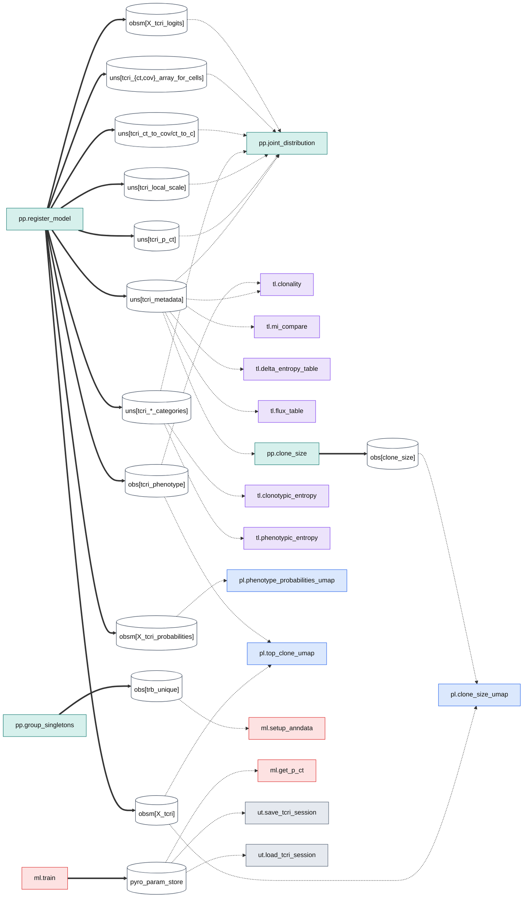

# TCRI — Dependency Map (target API)

_Call graph + `adata`-state producer/consumer links for the post-refactor API. Curated from `build_tcri_contract.py`; regenerate with `build_tcri_depgraph.py`._

**Two graphs, same nodes.** (1) **Call graph** — `pl` → `tl` → `pp` → `ml`, bottoming out at the model + shared `core` primitives. (2) **Dataflow** — everything funnels through the `tcri_*` state that `pp.register_model` writes; `pp.joint_distribution` is the universal consumer hub.

## Call graph

```mermaid
flowchart TB
  subgraph PL
    n_pl_mutual_information["pl.mutual_information"]
    n_pl_clonotypic_entropy["pl.clonotypic_entropy"]
    n_pl_phenotypic_entropy["pl.phenotypic_entropy"]
    n_pl_clonality["pl.clonality"]
    n_pl_flux["pl.flux"]
    n_pl_mi_compare["pl.mi_compare"]
    n_pl_bayesian_mutual_information["pl.bayesian_mutual_information"]
    n_pl_ridge_delta_entropy["pl.ridge_delta_entropy"]
    n_pl_phenotypic_flux["pl.phenotypic_flux"]
    n_pl_polar_plot["pl.polar_plot"]
    n_pl_clone_size_umap["pl.clone_size_umap"]
    n_pl_model_loss["pl.model_loss"]
    n_pl_archetypes["pl.archetypes"]
  end
  subgraph TL
    n_tl_clonotypic_entropy["tl.clonotypic_entropy"]
    n_tl_phenotypic_entropy["tl.phenotypic_entropy"]
    n_tl_mutual_information["tl.mutual_information"]
    n_tl_clonality["tl.clonality"]
    n_tl_flux["tl.flux"]
    n_tl_delta_clonotypic_entropy["tl.delta_clonotypic_entropy"]
    n_tl_mi_compare["tl.mi_compare"]
    n_tl_delta_entropy_table["tl.delta_entropy_table"]
    n_tl_flux_table["tl.flux_table"]
  end
  subgraph PP
    n_pp_register_model["pp.register_model"]
    n_pp_joint_distribution["pp.joint_distribution"]
    n_pp_clone_size["pp.clone_size"]
  end
  subgraph ML
    n_ml_setup_anndata["ml.setup_anndata"]
    n_ml_train["ml.train"]
    n_ml_get_latent_representation["ml.get_latent_representation"]
    n_ml_get_cell_phenotype_probs["ml.get_cell_phenotype_probs"]
    n_ml_get_p_ct["ml.get_p_ct"]
  end
  subgraph CORE
    n_core__joint_to_mi["core._joint_to_mi"]
    n_core__stats_distance["core._stats.distance"]
    n_core__stats_auc_perm["core._stats.auc_perm"]
    n_core__stats_bootstrap_auc["core._stats.bootstrap_auc"]
    n_core__group_table["core._group_table"]
    n_core__metric_boxplot["core._metric_boxplot"]
    n_core__build_sankey["core._build_sankey"]
  end
  subgraph UT
    n_ut_save_tcri_session["ut.save_tcri_session"]
    n_ut_load_tcri_session["ut.load_tcri_session"]
    n_ut_write_adata_safely["ut.write_adata_safely"]
  end
  n_pl_mutual_information --> n_tl_mutual_information
  n_pl_clonotypic_entropy --> n_tl_clonotypic_entropy
  n_pl_phenotypic_entropy --> n_tl_phenotypic_entropy
  n_pl_clonality --> n_tl_clonality
  n_pl_clonality --> n_core__metric_boxplot
  n_pl_flux --> n_tl_flux
  n_pl_mi_compare --> n_tl_mi_compare
  n_pl_mi_compare --> n_core__stats_auc_perm
  n_pl_mi_compare --> n_core__stats_bootstrap_auc
  n_pl_bayesian_mutual_information --> n_tl_mutual_information
  n_pl_ridge_delta_entropy --> n_tl_delta_entropy_table
  n_pl_phenotypic_flux --> n_pp_joint_distribution
  n_pl_phenotypic_flux --> n_core__build_sankey
  n_pl_polar_plot --> n_pp_joint_distribution
  n_pl_polar_plot --> n_tl_clonotypic_entropy
  n_pl_clone_size_umap --> n_pp_clone_size
  n_pl_model_loss --> n_ml_train
  n_pl_archetypes --> n_ml_train
  n_tl_clonotypic_entropy --> n_pp_joint_distribution
  n_tl_phenotypic_entropy --> n_pp_joint_distribution
  n_tl_mutual_information --> n_pp_joint_distribution
  n_tl_mutual_information --> n_core__joint_to_mi
  n_tl_flux --> n_pp_joint_distribution
  n_tl_flux --> n_core__stats_distance
  n_tl_delta_clonotypic_entropy --> n_tl_clonotypic_entropy
  n_tl_mi_compare --> n_tl_mutual_information
  n_tl_mi_compare --> n_core__group_table
  n_tl_delta_entropy_table --> n_tl_delta_clonotypic_entropy
  n_tl_delta_entropy_table --> n_core__group_table
  n_tl_flux_table --> n_tl_flux
  n_tl_flux_table --> n_core__group_table
  n_pp_register_model --> n_ml_get_cell_phenotype_probs
  n_pp_register_model --> n_ml_get_latent_representation
  n_pp_register_model --> n_ml_get_p_ct
  n_ml_get_cell_phenotype_probs --> n_ml_get_p_ct
  n_ut_save_tcri_session --> n_ut_write_adata_safely
  n_ut_load_tcri_session --> n_ml_setup_anndata
  classDef ml fill:#fde2e2,stroke:#dc2626,color:#111;
  classDef pp fill:#d6f0ec,stroke:#0f766e,color:#111;
  classDef tl fill:#ece3fb,stroke:#7c3aed,color:#111;
  classDef pl fill:#dbe8fd,stroke:#2563eb,color:#111;
  classDef ut fill:#e5e9ef,stroke:#475569,color:#111;
  classDef core fill:#fef3c7,stroke:#b45309,color:#111;
  classDef state fill:#ffffff,stroke:#334155,color:#111;
  class n_ml_setup_anndata ml;
  class n_ml_train ml;
  class n_ml_get_latent_representation ml;
  class n_ml_get_cell_phenotype_probs ml;
  class n_ml_get_p_ct ml;
  class n_pp_register_model pp;
  class n_pp_joint_distribution pp;
  class n_pp_clone_size pp;
  class n_tl_clonotypic_entropy tl;
  class n_tl_phenotypic_entropy tl;
  class n_tl_mutual_information tl;
  class n_tl_clonality tl;
  class n_tl_flux tl;
  class n_tl_delta_clonotypic_entropy tl;
  class n_tl_mi_compare tl;
  class n_tl_delta_entropy_table tl;
  class n_tl_flux_table tl;
  class n_pl_mutual_information pl;
  class n_pl_clonotypic_entropy pl;
  class n_pl_phenotypic_entropy pl;
  class n_pl_clonality pl;
  class n_pl_flux pl;
  class n_pl_mi_compare pl;
  class n_pl_bayesian_mutual_information pl;
  class n_pl_ridge_delta_entropy pl;
  class n_pl_phenotypic_flux pl;
  class n_pl_polar_plot pl;
  class n_pl_clone_size_umap pl;
  class n_pl_model_loss pl;
  class n_pl_archetypes pl;
  class n_ut_save_tcri_session ut;
  class n_ut_load_tcri_session ut;
  class n_ut_write_adata_safely ut;
  class n_core__joint_to_mi core;
  class n_core__stats_distance core;
  class n_core__stats_auc_perm core;
  class n_core__stats_bootstrap_auc core;
  class n_core__group_table core;
  class n_core__metric_boxplot core;
  class n_core__build_sankey core;
```



### Call adjacency

| function | calls | called by |
|---|---|---|
| `ml.setup_anndata` | — | `ut.load_tcri_session` |
| `ml.train` | — | `pl.model_loss`, `pl.archetypes` |
| `ml.get_latent_representation` | — | `pp.register_model` |
| `ml.get_cell_phenotype_probs` | `ml.get_p_ct` | `pp.register_model` |
| `ml.get_p_ct` | — | `pp.register_model`, `ml.get_cell_phenotype_probs` |
| `pp.register_model` | `ml.get_cell_phenotype_probs`, `ml.get_latent_representation`, `ml.get_p_ct` | — |
| `pp.joint_distribution` | — | `pl.phenotypic_flux`, `pl.polar_plot`, `tl.clonotypic_entropy`, `tl.phenotypic_entropy`, `tl.mutual_information`, `tl.flux` |
| `pp.clone_size` | — | `pl.clone_size_umap` |
| `tl.clonotypic_entropy` | `pp.joint_distribution` | `pl.clonotypic_entropy`, `pl.polar_plot`, `tl.delta_clonotypic_entropy` |
| `tl.phenotypic_entropy` | `pp.joint_distribution` | `pl.phenotypic_entropy` |
| `tl.mutual_information` | `pp.joint_distribution`, `core._joint_to_mi` | `pl.mutual_information`, `pl.bayesian_mutual_information`, `tl.mi_compare` |
| `tl.clonality` | — | `pl.clonality` |
| `tl.flux` | `pp.joint_distribution`, `core._stats.distance` | `pl.flux`, `tl.flux_table` |
| `tl.delta_clonotypic_entropy` | `tl.clonotypic_entropy` | `tl.delta_entropy_table` |
| `tl.mi_compare` | `tl.mutual_information`, `core._group_table` | `pl.mi_compare` |
| `tl.delta_entropy_table` | `tl.delta_clonotypic_entropy`, `core._group_table` | `pl.ridge_delta_entropy` |
| `tl.flux_table` | `tl.flux`, `core._group_table` | — |
| `pl.mutual_information` | `tl.mutual_information` | — |
| `pl.clonotypic_entropy` | `tl.clonotypic_entropy` | — |
| `pl.phenotypic_entropy` | `tl.phenotypic_entropy` | — |
| `pl.clonality` | `tl.clonality`, `core._metric_boxplot` | — |
| `pl.flux` | `tl.flux` | — |
| `pl.mi_compare` | `tl.mi_compare`, `core._stats.auc_perm`, `core._stats.bootstrap_auc` | — |
| `pl.bayesian_mutual_information` | `tl.mutual_information` | — |
| `pl.ridge_delta_entropy` | `tl.delta_entropy_table` | — |
| `pl.phenotypic_flux` | `pp.joint_distribution`, `core._build_sankey` | — |
| `pl.polar_plot` | `pp.joint_distribution`, `tl.clonotypic_entropy` | — |
| `pl.clone_size_umap` | `pp.clone_size` | — |
| `pl.model_loss` | `ml.train` | — |
| `pl.archetypes` | `ml.train` | — |
| `ut.save_tcri_session` | `ut.write_adata_safely` | — |
| `ut.load_tcri_session` | `ml.setup_anndata` | — |
| `ut.write_adata_safely` | — | `ut.save_tcri_session` |
| `core._joint_to_mi` | — | `tl.mutual_information` |
| `core._stats.distance` | — | `tl.flux` |
| `core._stats.auc_perm` | — | `pl.mi_compare` |
| `core._stats.bootstrap_auc` | — | `pl.mi_compare` |
| `core._group_table` | — | `tl.mi_compare`, `tl.delta_entropy_table`, `tl.flux_table` |
| `core._metric_boxplot` | — | `pl.clonality` |
| `core._build_sankey` | — | `pl.phenotypic_flux` |

**Entry points** (no caller): `pp.register_model`, `pp.group_singletons`, `pp.filter_genes`, `pl.mutual_information`, `pl.clonotypic_entropy`, `pl.phenotypic_entropy`, `pl.clonality`, `pl.flux`, `pl.mi_compare`, `pl.bayesian_mutual_information`, `pl.ridge_delta_entropy`, `pl.phenotypic_flux`, `pl.polar_plot`, `pl.clone_size_umap`, `pl.top_clone_umap`, `pl.phenotype_probabilities_umap`, `pl.model_loss`, `pl.archetypes`, `pl.model_pgm`, `ut.save_tcri_session`, `ut.load_tcri_session`

**Leaves** (call nothing in-package): `ml.setup_anndata`, `ml.train`, `ml.get_latent_representation`, `ml.get_p_ct`, `ml.boost_phenotype_prior`, `pp.joint_distribution`, `pp.group_singletons`, `pp.clone_size`, `pp.filter_genes`, `core._joint_to_mi`, `core._stats.distance`, `core._stats.auc_perm`, `core._stats.bootstrap_auc`, `core._group_table`, `core._metric_boxplot`, `core._build_sankey`

## Dataflow (producers / consumers)



### State producer/consumer table

| adata key | produced by | consumed by |
|---|---|---|
| `uns[tcri_metadata]` | `pp.register_model` | `pp.joint_distribution`, `tl.clonality`, `tl.mi_compare`, `tl.delta_entropy_table`, `tl.flux_table`, `pp.clone_size` |
| `uns[tcri_p_ct]` | `pp.register_model` | `pp.joint_distribution` |
| `uns[tcri_local_scale]` | `pp.register_model` | `pp.joint_distribution` |
| `uns[tcri_*_categories]` | `pp.register_model` | `pp.joint_distribution`, `tl.clonotypic_entropy`, `tl.phenotypic_entropy` |
| `uns[tcri_ct_to_cov/ct_to_c]` | `pp.register_model` | `pp.joint_distribution` |
| `uns[tcri_{ct,cov}_array_for_cells]` | `pp.register_model` | `pp.joint_distribution` |
| `obsm[X_tcri_logits]` | `pp.register_model` | `pp.joint_distribution` |
| `obsm[X_tcri_probabilities]` | `pp.register_model` | `pl.phenotype_probabilities_umap` |
| `obsm[X_tcri]` | `pp.register_model` | `pl.clone_size_umap`, `pl.top_clone_umap` |
| `obs[tcri_phenotype]` | `pp.register_model` | `tl.clonality`, `pl.top_clone_umap` |
| `obs[clone_size]` | `pp.clone_size` | `pl.clone_size_umap` |
| `obs[trb_unique]` | `pp.group_singletons` | `ml.setup_anndata` |
| `pyro_param_store` | `ml.train` | `ml.get_p_ct`, `ut.save_tcri_session`, `ut.load_tcri_session` |

> Metrics that read only `uns[tcri_metadata]` + categories **via** `pp.joint_distribution` are attributed to that hub, not re-listed per key.

## How this is built / standard tooling

**Call graph (who-calls-whom).** The de-facto standard is a directed graph rendered with **Graphviz/DOT**. Auto-extract from source with the stdlib `ast` module, or tools like `pyan3`, `code2flow`, `pydeps` (module-level), or `griffe` (the engine behind mkdocstrings). For Markdown-native rendering use **Mermaid** `flowchart` (GitHub renders it inline); for interactive web use `cytoscape.js` or `d3`.

**Dataflow / producer-consumer.** Because TCRI couples through `adata.uns/obsm/obs` keys (not just direct calls), the precise model is a **bipartite graph** of functions ↔ state keys. This is exactly a **build-system DAG**: state keys are the artifacts/targets, functions are the rules. The standard tools for that shape are **Make**, **Snakemake**, or **dbt** (`dbt docs` renders an interactive lineage graph) — and the same idea is what scverse calls a _data-flow_/provenance graph. Here it is curated by hand from the contract so it can lead the refactor rather than trail it.

**Preventing drift after the refactor.** Once the target lands, point an `ast` walker at `tcri/` to extract the _actual_ call edges + `uns/obsm/obs` read/writes and diff them against this curated graph in CI. Drift = a function that calls or reads/writes something the contract doesn't list.

## Graphviz

A combined DOT file is emitted to `tcri_dependency_map.dot` (call edges solid, writes bold-teal, reads dashed). Render:

```bash
dot -Tsvg tcri_dependency_map.dot -o tcri_dependency_map.svg
```