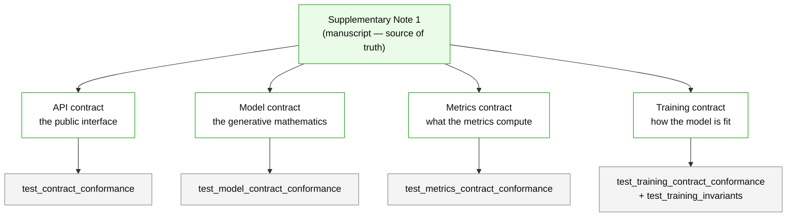

# The contracts

TCRi is governed by four **frozen, machine-checked contracts**. Each pins one facet of the
package — the public interface, the generative mathematics, the metric definitions, and the
training plan — so that a change to any of them is deliberate and reviewed rather than
accidental. The manuscript (**Supplementary Note 1**) is upstream of all of them.

```{note}
This page is a reader's overview. The authoritative prose lives in `docs/contract/` and the
machine-checkable manifests live next to the code. Only the maintainers (@nceglia, @salehis)
may change a contract, a conformance test, or a source document.
```

## Why contracts

A published number — a mutual information in bits, a phenotype call — only means something
if the definition behind it is stable. These contracts make each definition explicit and
enforce it with a test, so that:

- the model the package *claims* to implement is the model it *does* implement;
- a metric cannot be silently redefined, which would change what every past figure means;
- the training plan (which the note leaves largely unspecified) has recorded, behavioural
  bounds rather than folklore defaults.

**A failing conformance test means _stop and decide_** — is this an intended change (update
the contract first, deliberately) or a regression (fix the code)? It never means "loosen the
manifest until it passes."

## The four contracts



| Contract | Freezes | Manifest | Prose |
|----------|---------|----------|-------|
| **API** | the public interface | `tcri/_contract.pyi` | `API_CONTRACT.md` |
| **Model** | the generative mathematics | `tcri/model/_model_contract.py` | `MODEL_CONTRACT.md` |
| **Metrics** | what the metrics compute | `tcri/tools/_metrics_contract.py` | `METRICS_CONTRACT.md` |
| **Training** | how the model is fit | `tcri/model/_training_contract.py` | `TRAINING_CONTRACT.md` |

### API contract

Freezes the **public interface** — the namespaces (`tcri.ml`, `tcri.tl`, `tcri.pp`,
`tcri.pl`, `tcri.diag`, `tcri.ut`, `tcri.datasets`) and the signatures within them. The
`.pyi` stub is the source of truth; the conformance test walks the live package and checks
each declared symbol exists with the declared signature.

### Model contract

Freezes the **generative mathematics** of [the model](../concepts/model.md): each stochastic
site, its distribution family and plate, the ELBO, and the phenotype surrogate. The test
*traces* the live `model()`/`guide()` and asserts every site, scale, and index map
**behaviourally** — a scalar or source-text check is not enough. Accepted departures from
the note live in `SANCTIONED_DEVIATIONS`.

### Metrics contract

Freezes **what the metrics compute** — the two entropies and mutual information over the
clone × phenotype joint (see [the metrics concepts](../concepts/metrics.md)). Because metrics
are pure functions of a joint table, they are pinned by **numeric identities**, the keystone
being

$$I(c;\phi) = H(c) - \sum_\phi P(\phi)\,H[P(c\mid\phi)],$$

which ties the entropy and MI families together so neither can be redefined alone. The one
deliberate divergence from the note — `normalize_mode="min"` as the default instead of eq 6's
mean denominator — is recorded and pinned by a test.

### Training contract

Freezes **how the model is fit**. Because the note specifies the model structure but not the
training plan, this contract has two halves with different authority: `DERIVED_INVARIANTS`
follow from the ELBO (a violation is a defect), while `AUTHORED_BOUNDS` are the maintainers'
choices (changeable with a recorded reason). A bound must be **behavioural** — asserting that
a knob is *connected* is not asserting the behaviour is *right*. Two questions (minibatch
weighting and weight-decay-as-a-prior) are explicitly left open.

## Source documents

The manuscript and the metrics document are archived under `docs/contract/source/` with
their hashes recorded in a manifest and checked by a test, so a revision is *detectable*.
Their equation numbers **collide** — "eq 3" is the VampPrior in Note 1 but the clonotypic
entropy in the metrics document — so every reference names its document. The eq-by-eq code
map and deviation history live in `docs/contract/METHODS_CONFORMANCE.md`.
