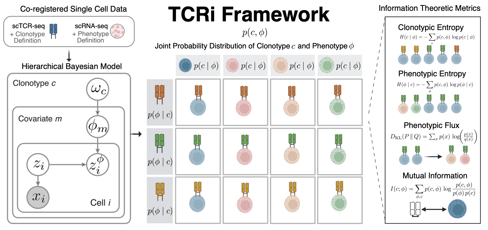

# TCRi Documentation

Information Theoretic Framework for Paired Single Cell Gene Expression and TCR Sequencing



## About TCRi

TCRi is a comprehensive framework for analyzing paired single-cell RNA and TCR sequencing data. It provides tools for joint distribution analysis, information theoretic metrics, visualization capabilities, and a deep learning model for phenotype prediction.

## Installation

```bash
python3 -m venv tvenv
source tvenv/bin/activate
python3 setup.py install
```

## Citation

If you use TCRi in your research, please cite:
```
@article{nceglia2022tcri,
  title={TCRi: An Information Theoretic Framework for Paired Single Cell Gene Expression and TCR Sequencing},
  author={Nceglia, Nicholas and others},
  journal={bioRxiv},
  year={2022}
}
```

## Documentation Contents

```{toctree}
:maxdepth: 2
:caption: Contents:

usage/installation
usage/quickstart
api/model
api/preprocessing
api/metrics
api/plotting
api/utils
```

## Links

* [GitHub Repository](https://github.com/nceglia/tcri)
* [Issue Tracker](https://github.com/nceglia/tcri/issues)
* [Paper](https://www.biorxiv.org/content/10.1101/2022.10.01.510457v1)
