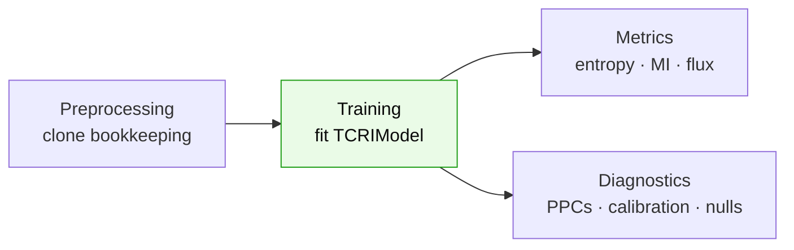

# Tutorials

End-to-end, runnable examples. Each one stands alone and uses the synthetic generator
{func}`tcri.datasets.simulate_tcri` — no external data required — so you can paste it into a
notebook and run it top to bottom. The code mirrors TCRi's own test suite.



```{toctree}
:maxdepth: 1

preprocessing
training
metrics
diagnostics
```

## The five-line version

```python
import tcri

adata = tcri.datasets.simulate_tcri(seed=0)
tcri.ml.TCRIModel.setup_anndata(
    adata, layer="counts", clonotype_key="clone_id",
    phenotype_key="phenotype", covariate_key="covariate", batch_key="batch",
)
model = tcri.ml.TCRIModel(adata, seed=0)
model.train(max_epochs=100, batch_size=256)
model.to_anndata(adata)
mi = tcri.tl.mutual_information(adata, covariate="cov_0", normalize_mode="average")
```

The defaults are sensible, so the snippet stays short. When you do want to reach for a
knob, these are the high-value ones — grouped by the three calls above. The full lists live
in the per-step tutorials.

### 1 · Register — `setup_anndata`

| Argument | Points to | Example |
| --- | --- | --- |
| `layer` | AnnData layer holding raw counts | `"counts"` |
| `clonotype_key` | `obs` column: clonotype id (e.g. TRB) | `"clone_id"` |
| `phenotype_key` | `obs` column: cell-state / phenotype label | `"phenotype"` |
| `covariate_key` | `obs` column: condition to compare across (timepoint, response) | `"covariate"` |
| `batch_key` | `obs` column: batch / donor | `"batch"` |

These are placeholders — pass the column names from *your* `adata.obs`. See {doc}`preprocessing`.

### 2 · Build — `TCRIModel(...)`

| Knob | Default | What it does |
| --- | --- | --- |
| `n_latent` | `128` | size of the latent space |
| `n_layers` | `3` | encoder / decoder depth |
| `global_scale` (α) | `5.0` | how strongly clones are pulled toward shared archetypes |
| `local_scale` (β) | `3.0` | how strongly cells follow their clone's phenotype prior |
| `K` | `10` | number of clone archetypes (capped at the clonotype count) |

Remaining knobs (gating weight π, phenotype-KL γ, pseudo-observations, `seed`) are covered in {doc}`training`.

### 3 · Train — `model.train(...)`

| Knob | Default | What it does |
| --- | --- | --- |
| `max_epochs` | `1000` | training budget |
| `batch_size` | `1000` | minibatch size — use 256–1024 (warns if ≥ n_obs) |
| `lr` | `1e-3` | Adam learning rate |
| `reconstruction_loss_scale` | `1e-2` | weight on the ZINB counts vs the latent prior |
| `n_steps_kl_warmup` | `2000` | optimizer steps to ramp the latent KL 0 → 1 |

Early stopping and the KL-ramp behavior are detailed in {doc}`training`.
