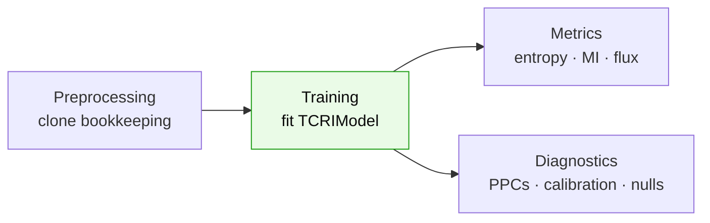

# Tutorials

End-to-end, runnable examples. Each one stands alone and uses the synthetic generator
{func}`tcri.datasets.simulate_tcri` — no external data required — so you can paste it into a
notebook and run it top to bottom. The code mirrors TCRi's own test suite.



```{toctree}
:maxdepth: 1

preprocessing
training
metrics
diagnostics
```

## The five-line version

```python
import tcri

adata = tcri.datasets.simulate_tcri(seed=0)
tcri.ml.TCRIModel.setup_anndata(
    adata, layer="counts", clonotype_key="clone_id",
    phenotype_key="phenotype", covariate_key="covariate", batch_key="batch",
)
model = tcri.ml.TCRIModel(adata, seed=0)
model.train(max_epochs=100, batch_size=256)
model.to_anndata(adata)
mi = tcri.tl.mutual_information(adata, covariate="cov_0", normalize_mode="average")
```
